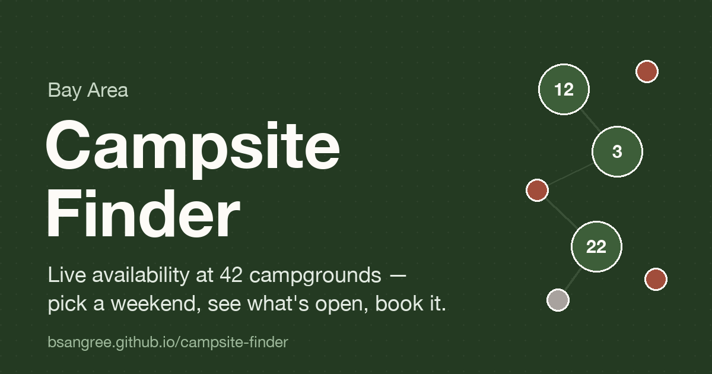

# Bay Area Campsite Finder

**Live: https://bsangree.github.io/campsite-finder/**

One page that answers "where can I camp this weekend?" — live availability across
45+ campgrounds from Mendocino to Big Sur, in the one place the official sites don't
offer: side by side.

- **List view** — every campground with a live open-site count for your dates
- **Map view** — the same thing on a topo map: green = open (with count), rust = full
- **Scan 8 weekends** — a parks × Fridays grid, so a whole summer of openings is one glance
- Filters (drive time from SF, redwoods/coast/lake, dogs, RV), shareable URLs, and
  booking links that carry your dates straight into the reservation flow

## How it works

The whole app is **one `index.html`** — no framework, no build step, no backend, no
database. Park data is a JS array in the file. Tailwind and Leaflet come from CDNs.
GitHub Pages serves it; pushing to `main` is the deploy.

Live availability comes from the same public data feeds the reservation sites' own
pages load (ReserveCalifornia and Recreation.gov). Your browser calls them directly —
there's no server in the middle, so 100 visitors look like 100 normal reservation-site
users, not one scraper.

A scheduled GitHub Action (`.github/workflows/record.yml`) has been logging
availability for every park since June 2026 to the `data` branch — for both weekend
(Friday) and midweek (Wednesday) arrivals. From that history it computes per-park
cancellation stats hourly (`stats.json`: "opened 9× in 30 days, usually Wed mornings"),
which the site shows on full parks. Parks listed in `watches.json` additionally trigger
a push notification (via [ntfy.sh](https://ntfy.sh)) the moment they flip from full to
open. All of it runs free on public-repo Actions — still no server.

## The story

I'm not an engineer — I work in sales. This was built by describing what I wanted to
[Claude Code](https://claude.com/claude-code) over a handful of sessions: the park
list, the availability integrations, the design system, the map, the recorder, and
every bug fix along the way. Then I used it to book three real camping trips.

## Caveats

Personal tool, shared as-is. The availability feeds are unofficial and may change
without notice — if statuses stop loading, the booking links still work. Not
affiliated with California State Parks, the National Park Service, or any park system.

Header photo: Bradley Lembach / Unsplash.
